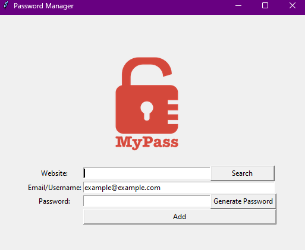

# Password Manager
## Overview
Hello everyone! I'm Mert, and today is Day 29 of my "100 Days of Python" challenge. In this project, I've developed a Password Manager using Tkinter for the user interface and a custom Password Generator.

## Project Description
The Password Manager provides a simple and secure way to manage and generate passwords for various websites. It allows users to save their website, email, and password information securely and generate strong passwords using the built-in Password Generator.

## Password Generator
The Password Generator uses a combination of letters (both uppercase and lowercase), numbers, and symbols to create strong and secure passwords. It ensures that the generated passwords meet the recommended criteria for strength.

## How to Run
To use the Password Manager, follow these steps:

* Run the Python script:
   ```bash
   python main.py
   ```


* Fill in the required information for the website, email, and password.

* Click the "Generate Password" button to create a strong and random password.

* Click the "Add" button to save the entered details securely.

* Use the "Search" button to find and display saved passwords for a specific website.

* Make sure you have Python installed on your system.


## Project Files
* main.py: The main Python script for the Password Manager.
* password_generator.py: The module containing the Password Generator function.
  
## Geting Started
* Run the script and fill in the necessary information.
* Use the "Generate Password" button to create strong passwords.
* To securely save the entered details, click on the 'Add' button. The saved data will be stored in a file named 'data.json'.
* Use the "Search" button to find and display saved passwords for a specific website.
  
# Used Libraries
The following Python libraries were used in this project:

* Tkinter: For creating the graphical user interface.
* random: For generating random characters for the Password Generator.
* messagebox (from tkinter): For displaying alerts and messages.
* pyperclip: For copying the generated password to the clipboard.
  
## Educational Insights
This project provides hands-on experience with key Python concepts:

* Tkinter GUI: Creating a graphical user interface for easy interaction.
* Function Implementation: Defining functions to perform specific tasks.
* Password Generation: Implementing a custom Password Generator.
* File Handling: Saving and retrieving information from a text file securely.
## Update
### Differences between the Original and Updated Versions
* Data Storage Format: The data storage format has been updated from a plain text file (data.txt) to a JSON file (data.json) for better structure and security.
* File Handling Improvement: The code now uses a try-except block for file operations, ensuring a more robust handling of file-related operations.
* Data Storage Structure: Passwords are now stored in a nested dictionary structure within the JSON file, providing a more organized way to manage and retrieve data.
* Case Insensitivity: Website names are converted to lowercase during data storage, ensuring case-insensitive search and retrieval.
* Enhanced User Interface: The UI remains user-friendly, but the code now ensures a more consistent and standardized experience for the users.
* 
## Conclusion
I hope you find the Password Manager and Password Generator helpful for managing your credentials securely! It's been a great journey reaching Day 29, and I'm excited to continue exploring and learning. Happy coding!
